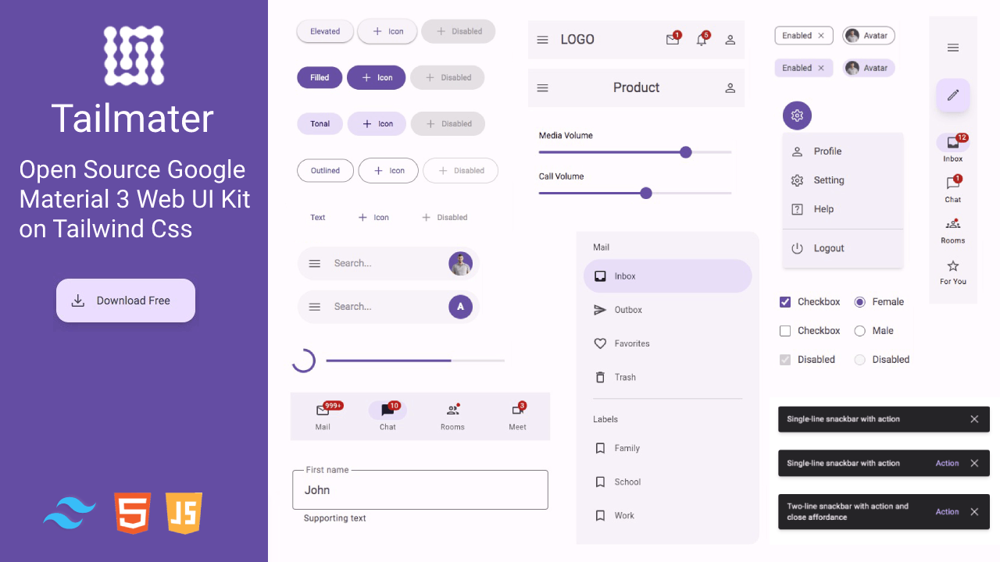
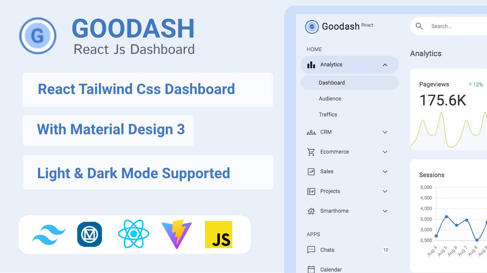

# Tailmater UI Kit


Tailmater is an open source Modern Web Material 3 UI Kit based on Tailwind css framework. Built with [Material Design 3](https://m3.material.io/) the latest version of Google's open-source design system. Tailmater use the MIT license so you can use it included in a commercial project. Credit to the Github page will always be appreciated. Development by [@ari_budin](https://twitter.com/ari_budin) . Pro Version available [Goodash Html](https://aribudin.gumroad.com/l/goodash) . React Version available [Goodash React](https://aribudin.gumroad.com/l/goodash-react) .  Next Js Version available [Goodash Next Js](https://aribudin.gumroad.com/l/goodash-next)

## Demo Preview

Demo: [https://aribudin.github.io/tailmater/](https://aribudin.github.io/tailmater/)

## Installation

* Clone the repository with the following command:

```
git clone https://github.com/aribudin/tailmater.git
```
* Run in terminal this command:

```
npx tailwindcss -i ./src/tailwindcss/tailwind.css -o ./src/css/style.css --watch
```
* Open html file in browser and start editing

## Download file

Download .zip file [in here](https://github.com/aribudin/tailmater/releases)
                    
## Tailmater JavaScript

We provide examples of vanilla javascript functions for all Tailmater components. There are several components that require triggers to run such as snackbars, dialogs, range sliders and others.

Put the script in the last line before close body
```
<script src="src/js/tailmater.js"></script>
```

**Toggles**

Type  | Call  | Target  | Class
------------- | ------------- | ------------- | -------------
data-type="toggle"  | data-target="#value"  | id="value"  | .show

**Accordion**

Type  | Call  | Target  | Role  | Class
------------- | ------------- | ------------- | ------------- | -------------
data-type="collapse"  | data-target="#value"  | id="value"  | role="collapsed"  | .active

**Sheets**
                    
Type  | Call  | Target  | Close  | Class
------------- | ------------- | ------------- | ------------- | -------------
data-type="sheets"  | data-target="#value"  | id="value"  | data-close="#value"  | .show

**Dialogs**
                    
Type  | Call  | Target  | Close  | Class
------------- | ------------- | ------------- | ------------- | -------------
data-type="dialogs"  | data-target="#value"  | id="value"  | data-close="#value"  | .show

**Menus**
                    
Type  | Call  | Target  | Role  | Class
------------- | ------------- | ------------- | ------------- | -------------
data-type="dropdown"  | data-target="#value"  | id="value"  | role="dropdownmenu"  | .show

**Snackbar**
                    
Type  | Cal  | Target  | Close  | Class
------------- | ------------- | ------------- | ------------- | -------------
data-type="snackbar"  | data-target="#value"  | id="value"  | data-close="#value"  | .show

**Tabs**
                    
Type  | Call  | Target  | Role  | Role 2  | Class
------------- | ------------- | ------------- | ------------- | ------------- | -------------
data-type="tabs"  | data-target="#value"  | id="value"  | role="tabpanel"  | role="indicator"  | .active

**Circle Progress**
                    
Role  | Role 2  | Value(0-100)
------------- | ------------- | -------------
role="progress_bg"  | role="progress_fill"  | data-percent="value"

**Dark Mode**
                    
Type  | Target  | Storage  | Class
------------- | ------------- | ------------- | -------------
data-type="theme"  | html  | localStorage.theme  | .dark

**Range slider**
                    
Type  | Target
------------- | -------------
data-type="slider"  | nextElement

**Navbar Scroll Up**
                    
Target  | Offset  | Class Visible  | Class Fixed
------------- | ------------- | ------------- | -------------
role="navtop"  | header  | .is-visible  | .is-fixed

**Segmented Button**
                    
Target  | Status active
------------- | -------------
.segmented-item > input  | checked

## Sources

[Download Figma design](https://www.figma.com/community/file/1035203688168086460)


## PRO VERSION HTML, REACT, NEXT JS

[Goodash - Tailwind Material Design 3 Dashboard](https://aribudin.gumroad.com/l/goodash)
[Goodash React - Dashboard Material Design 3 & Tailwind Css](https://aribudin.gumroad.com/l/goodash-react)
[Goodash Next Js - Dashboard Material Design 3 & Tailwind Css](https://aribudin.gumroad.com/l/goodash-next)

## Authors & Sponsors

* Ari Budin [@ari_budin](https://twitter.com/ari_budin)
* Tailwind Dashboard [Taildash](https://tailwinddashboard.com/)
* Tailwind Templates [Tailnet](https://themes.tailwindtemplate.net/)
  
## Credits

* [Material Design 3](https://m3.material.io/)
* [Tailwind Css](https://tailwindcss.com/)
